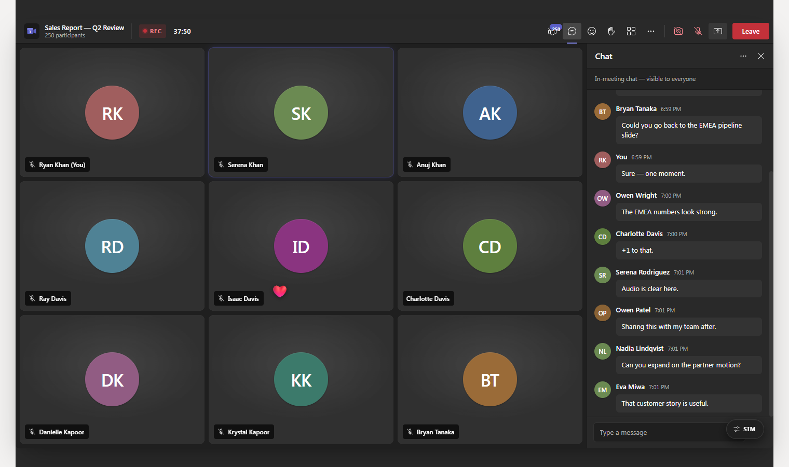

# Teams Call Simulator

A pixel-faithful Microsoft Teams group meeting simulator. Runs in the browser
or as a frameless Electron desktop app.



## What it does

Simulates a Teams call with up to 1,000 audience members. Tunable controls
dial up engagement, background noise, and auto-chat rate; reactions float
up from individual tiles; participants raise hands; a presenter shares a
slide on the main stage. Useful for demos, screen-recording b-roll, design
mocks, or training tooling that needs a realistic meeting frame.

## Run

```bash
npm install
npm run dev              # browser at http://127.0.0.1:5173 (local-only simulator)
npm run electron:dev     # frameless Electron window (Vite + Electron concurrently)

# API-driven mode — start the .NET API first, then point the renderer at it:
dotnet run --project api/src/MeetingSim.Api/MeetingSim.Api.csproj
$env:VITE_API_URL = "http://localhost:63852"; npm run dev
```

When `VITE_API_URL` is set, the renderer creates a session on first load, subscribes to the `/hubs/session` SignalR hub, and renders state from server-pushed events. Without it, the existing local simulation runs unchanged.

## Package

```bash
npm run dist:win         # Windows NSIS installer + portable .exe into release/
npm run dist             # platform-default installer for the current OS
npm run dist:dir         # unpacked test build into release/win-unpacked/
```

## Stack

- **UI** — React 19 + Fluent UI v9 (`teamsDarkTheme`)
- **Build** — Vite 8
- **Desktop** — Electron 33 with sandboxed renderer, frameless title bar on
  Windows (custom min/max/close controls in the ribbon), per-user window
  state persistence

## Project layout

```
src/                      # React renderer
  main.jsx                # App composition + entry
  constants.js            # Names, palette, prompts, sim tunables
  helpers.js              # initials, formatElapsed, formatChatTime, makeParticipant
  styles.css              # Teams 2.0 design tokens
  components/
    Ribbon.jsx            # Top bar + window controls (Electron)
    Gallery.jsx           # 3×3 uniform gallery
    ContentStage.jsx      # Shared-content slide + filmstrip
    Tile.jsx              # Single participant tile
    ChatPane.jsx          # Right-rail chat thread
    PeoplePane.jsx        # Right-rail participants list
    SimPanel.jsx          # Floating simulator controls
electron/
  main.cjs                # Main process (frameless window, IPC, state)
  preload.cjs             # Sandboxed bridge: electronApp + windowControls
build/
  icon.png                # 512×512 app icon
api/                      # .NET 10 session API (see api/CLAUDE.md)
  MeetingSim.slnx
  src/
    MeetingSim.Core/      # Domain — sessions, personas, events
    MeetingSim.Api/       # HTTP + SignalR hub
    MeetingSim.Etl/       # Background workers (STT, moderator, persona, TTS)
    MeetingSim.Analyzers/ # CI0001–CI0013 style guards
  tests/
    MeetingSim.Tests.Unit/
    MeetingSim.Tests.Integration/
    MeetingSim.Tests.Architecture/
    MeetingSim.Tests.Analyzers/
```

## API

The session API is scaffolded from the [`dotnet-agent-harness`](https://github.com/ryan75195/dotnet-agent-harness) `etl-api` template. It will hold session state, run the AI moderator + persona agents on a transcript stream, and fan out events to renderer clients over SignalR. Slice 1 (this commit) is the scaffold only — endpoints land in subsequent slices.

```bash
dotnet build api/MeetingSim.slnx
dotnet test  api/MeetingSim.slnx
```

The repo follows the harness's lifecycle (issue → `feat/<N>-<slug>` branch → squash-merge) for any change touching `api/**`. Pure-frontend commits short-circuit through `.githooks/pre-commit` without running .NET checks. See [`api/CLAUDE.md`](api/CLAUDE.md) for the full .NET-side rules.

## Keyboard shortcuts

| Shortcut       | Action               |
| -------------- | -------------------- |
| `Ctrl+Shift+M` | Toggle mute          |
| `Ctrl+Shift+O` | Toggle camera        |
| `Ctrl+Shift+K` | Raise / lower hand   |
| `Ctrl+E`       | Toggle chat pane     |

## Simulator controls

The floating **SIM** pill (bottom-right) opens a debug panel:

- Audience size — 9 to 1,000
- Engagement — drives chat rate and hand raises
- Background noise — drives random "speaking" events
- Auto chat / auto reactions — toggles for the trickle behaviour
- Applause surge — fires a burst of 🎉/👏 reactions
- Q&A rush — drops six questions into chat and raises hands across the room

## License

MIT — see [LICENSE](LICENSE).
